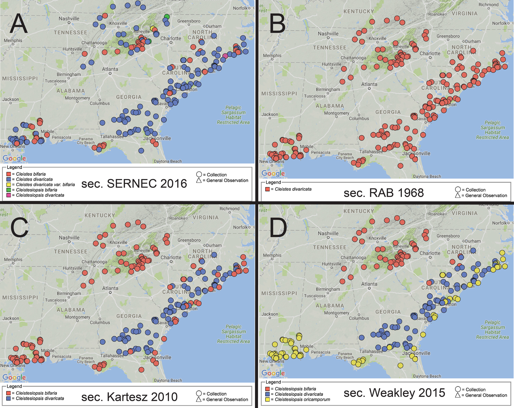

# Reproducibility Study in Biodiversity Informatics

## Project Description

[Biodiversity Informatics](https://en.wikipedia.org/wiki/Biodiversity_informatics)
is the application of informatics techniques to biodiversity information for
improved management, presentation, discovery, exploration and analysis. For
example, [ecological niche
modeling](https://en.wikipedia.org/wiki/Environmental_niche_modelling) refers
to the process of using computer algorithms to predict the distribution of
species in geographic space on the basis of a mathematical representation of
their known distribution in environmental space. 

The goal of this project is to implement an existing ecological niche model
as a so-called tale in the WholeTale execution environment, and then study
the reproducibility of the model outputs,  depending, e.g., on the chosen
input taxonomies used for the input data. The choice of an underlying
taxonomy can lead to rather [different species occurrence
maps](https://riojournal.com/lib/ajax_srv/article_elements_srv.php?journal_name=rio&action=zoom_figure&instance_id=3410264&article_id=10610) ([Franz et
al., 2016](https://riojournal.com/articles.php?id=10610&instance_id=3406054)),
which in turn is likely to influence the reproducibility of niche model outputs
based on those data (see, e.g., [Peterson et
al.,1999](http://dx.doi.org/10.1046/j.1523-1739.1999.013002427.x) for an
introductory exposition of the problem).

In this project, you will adopt an existing niche model and implement it, as a
Jupyter-based Python notebook or an RStudio notebook in the WholeTale
environment. Through different input datasets, you will compare different model
outputs, with the goal to better understand the _computational_ reproducibility
and the _semantic_ reproducibility of biodiversity studies that use
taxonomically annotated input data.

{:.centered-image}

"Where do these endangered orchid species occur?" - visualizing taxonomic
variations for aggregated herbarium data. Mappings for the same 250 SERNEC
specimens according to four distinct taxonomies:  (A) sec. SERNEC (2016)
'consensus', (B) sec. Radford et al. (1968), (C) sec. Kartesz (2010), (D) sec.
Weakley (2015). In A, C, and D, unequal sets of specimens labeled as bifaria
are red; those labeled as divaricata are blue. In B, all specimens are
identified as divaricata, and hence a query for bifaria would not return any
specimens.

## Necessary Prerequisites:

 * Interest in computational and data science
 * Programming experience in at least one of Python or R

## Desirable Skills and Interests:

 * Data science languages and tools (e.g., Python/Pandas or R/Tidyverse) 
 * Interest in biodiversity informatics, biology, or ecology.
 * Database experience, e.g., modeling and querying of relational data (SQL)

## Expected Outcomes:

 * Biodiversity case study (niche modeling) implemented in the WholeTale
   environment
 * Final project presentation (poster or talk)

**Primary Mentor**: Bertram Ludäscher, School of Information Sciences &
NCSA, University of Illinois, Urbana-Champaign

**Secondary Mentor(s)**:  Nico Franz,  Biodiversity Knowledge Integration
Center, School of Life Sciences, Arizona State University
