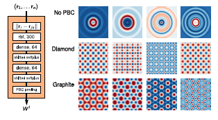

## Project Description

Machine learning models offer many advantages over other methods in the design
of new materials. For example, machine learning models can be much faster than
conventional, physics-based calculations and can be used when even the
underlying mechanism driving a property are not yet understood. These
advantages have inspired the development of many techniques for building
machine learning models using materials data, which have proven to be valuable
tools for accelerating materials design. However, the software and data
necessary to actually use many of these models is often unpublished and even
comparisons between similar techniques in the literature are rare. The lack of
replicability of these methods frustrates the ability of engineers to identify
appropriate methods and apply them to new problems.

In this project we aim to develop a library of example machine learning models
based on materials data. In particular, we will focus on a particularly common
type of machine learning model in materials: those that map the crystal
structure of a material to its properties. Many exciting methods (including
deep-learning-based techniques, as shown below) have been developed in the past
few years to address this very problem. The goal of this internship is to
generate examples of how to create and publish these models in Whole Tale so
that the methods are available to the community at large. With the ability to
run each of these techniques, we can then easily apply them to different
datasets and learn whether different methods work better for different
problems. Both the availability of examples on how to use these methods and the
knowledge about when each is most well suited will help further enable the use
of machine learning in materials design.

Filter design of the of the SchNet model (Schütt et al.,
arXiv:[1712.06113v1](https://arxiv.org/abs/1712.06113)) and the output of
example filters for different crystal structures.

## Necessary Prerequisites:
 * Python programming
 * Basic knowledge of data analysis in Python (e.g., Pandas, numpy)

## Desirable Skills / Qualifications:
 * Basic knowledge of materials science
 * Basic understanding of machine learning 

## Expected Outcomes:
 * Review of published models that map crystal structure of a material to its properties
 * Library of example machine learning models based on materials data
 * Published models in WholeTale

**Primary Mentor**: Kyle Chard, Computation Institute, University of Chicago
and Argonne National Laboratory

**Secondary Mentor(s)**: Logan Ward, Computation Institute, University of
Chicago and Argonne National Laboratory, Ben Blaiszik, Computation Institute,
University of Chicago and Argonne National Laboratory

